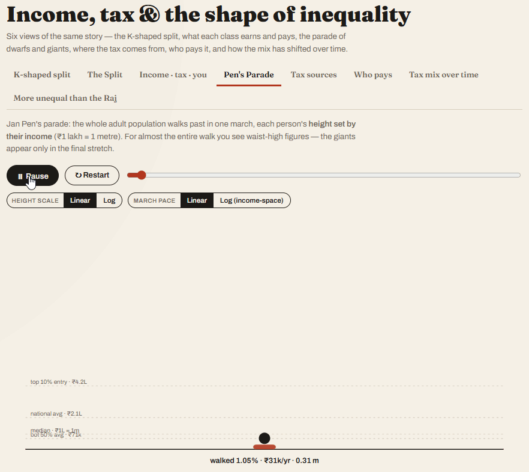
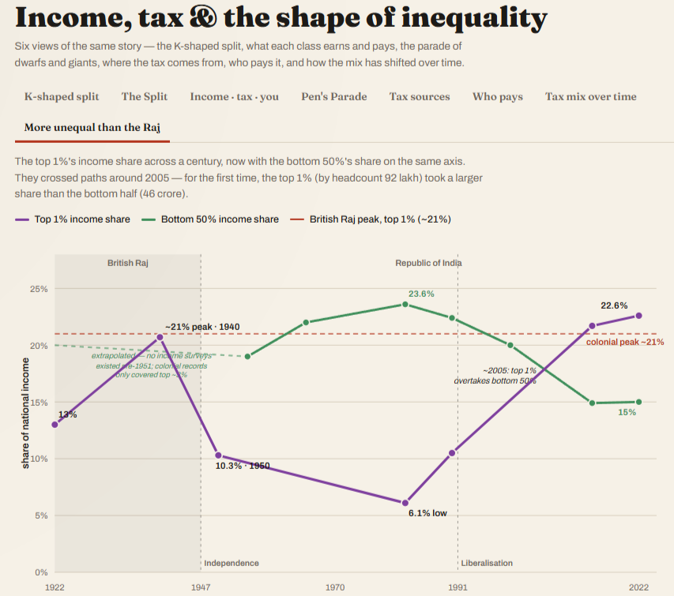

# Shape of Inequality

Six views of the same story — the K-shaped split, what each class earns and pays, the parade of dwarfs and giants, where the tax comes from, who pays it, and how the mix has shifted over time.

**An interactive data dashboard visualising India's income and wealth inequality from Independence to today — who holds what, per person and in aggregate, across income groups, tax structures, and a century of historical context.**

> Data: WID.world India (Bharti, Chancel, Piketty, Somanchi 2024) · CBDT · Union Budget FY 2025–26
---

## Preview
<div align="center">
  
  
</div>

---

## Live Demo

Serve locally (see below) or deploy to any static file host (Netlify, Vercel, GitHub Pages).

---

## Project Structure

```
shape-of-inequality/
├── index.html          # Shell HTML — panels + layout only, no inline data or logic
├── styles.css          # All visual styles
├── app.js              # All chart logic; reads from D (the loaded data object)
├── data/
│   └── data.json       # ← ALL data lives here. Update this file only.
└── README.md
```

**Data flow:**
```
data/data.json  →  fetch() at page load  →  window.D  →  app.js chart functions
```

No data is hardcoded in `index.html` or `app.js`. To update any number, edit `data.json` only.

---

## Running Locally

`fetch()` requires an HTTP server (not `file://`). Use any of:

```bash
# Python (built-in)
python -m http.server 8000
# then open http://localhost:8000

# Node (npx)
npx serve .

# VS Code Live Server extension
# Right-click index.html → "Open with Live Server"
```

---

## Updating the Data

All data lives in `data/data.json`. Keys and their sources:

| Key | What it is | Source | Update frequency |
|-----|-----------|--------|-----------------|
| `taxSlabs` | Income tax bracket boundaries and rates used in the calculator | Union Budget | **Every February** ⚠️ |
| `taxSurcharges` | Surcharge thresholds and rates (above ₹50L) | Union Budget | **Every February** ⚠️ |
| `taxSources` | Tax sources donut — share of central tax by head | Union Budget (BE) | **Every February** |
| `taxPayers` | Who pays — taxpayer and tax-paid distribution | CBDT Annual Information Statement | Annually (Sep–Oct) |
| `taxMixTab` | Tax mix over time — stacked area from Independence to present | CBDT historical; Budget | Annually |
| `incomeGroups` | Income · tax · you tab — per-group averages, tax, evadable estimate | WID.world 2022-23; CBDT; Ram Singh (2025) | Annually |
| `paradeIncome` | Pen's Parade — income at each percentile | WID.world 2022-23 | Annually |
| `paradeMarkers` | Income level markers shown on the Parade chart | WID.world 2022-23 | Annually |
| `kTab.incomeShares` | K-shaped split — income share lines (top 1%, top 10%, bottom 50%) | WID.world India | Annually |
| `splitTab.incomeByBand` | The Split — stacked income area by band | WID.world India | Annually |
| `splitTab.pcIncome` | Per-capita income evolution vs national mean | WID.world India | Annually |
| `rajTab` | Century chart — top 1% and bottom 50% income shares 1922–2022 | WID.world India | Annually |
| `kTab.wealthShares` | K-shaped split — wealth share lines | AIDIS/NSSO | Every 5–7 years |
| `splitTab.wealthByBand` | The Split — stacked wealth area by band | AIDIS/NSSO | Every 5–7 years |
| `splitTab.pcWealth` | Per-capita wealth evolution vs national mean | AIDIS/NSSO | Every 5–7 years |
| `events` | Historical event markers on stacked-area charts | Fixed | As needed |

> **⚠️ February priority:** `taxSlabs` and `taxSurcharges` drive the income tax calculator. Update these first, every Budget, before anything else. Wrong slabs = wrong tax numbers for every user who types in their income.

> **⚠️ Pre-publish:** Verify `incomeGroups` — `Top 0.1%` and `Top 0.01%` income averages against the latest WID India release before going live.

---

## Expected Data Update Schedule

| Data source | Expected release | Keys to update |
|-------------|-----------------|----------------|
| **Union Budget** | **Every February** | `taxSlabs`, `taxSurcharges`, `taxSources`, `taxMixTab` last entry |
| **CBDT Annual Report** | **September–October** | `taxPayers`, `incomeGroups.tax`, `incomeGroups.evad` |
| **WID.world India** | **6–18 months after reference year** | `incomeGroups`, `paradeIncome`, `paradeMarkers`, `kTab.incomeShares`, `splitTab.incomeByBand`, `splitTab.pcIncome`, `rajTab` |
| **AIDIS wealth survey** | **Every 5–7 years** | `kTab.wealthShares`, `splitTab.wealthByBand`, `splitTab.pcWealth` |
| **Pew PPP thresholds** | When World Bank revises PPP benchmarks | Class overlay thresholds in `incomeGroups` |
| **Ram Singh evasion estimate** | Paper-specific; not annual | `incomeGroups.evad` — update only if a new paper supersedes Singh (2025) |

**Practical recommendation:** Review in **March** (after Budget) and **October** (after CBDT report). The WID update is the most impactful but least predictable — subscribe at [wid.world](https://wid.world) for notifications.

---

## Data Sources & Citations

- **Bharti, N., Chancel, L., Piketty, T., Somanchi, A.** (2024). *Income and Wealth Inequality in India, 1922–2023: The Rise of the Billionaire Raj.* World Inequality Lab Working Paper.
- **Ram Singh** (2025). "Do the Wealthy Underreport Their Income?" *Review of Income and Wealth*, 71(2). Evasion and underreporting estimates.
- **PRICE/ICE360** (2021). Household income survey — India class boundaries.
- **Pew Research Center** — Global income tiers (2011 PPP).
- **CBDT** — Annual income tax statistics and taxpayer distribution.
- **Union Budget FY 2025–26** — Central tax revenue composition.
- **AIDIS/NSSO** — All-India Debt & Investment Survey (wealth shares).

---

## Tabs

| Tab | What it shows |
|-----|--------------|
| **K-shaped split** | Income + wealth shares for top 1%, top 10%, bottom 50% since 1982; per-capita ratio cards |
| **The Split** | Stacked area of how the national income/wealth pie divides among 4 bands, 1961–2022; per-capita evolution with zones |
| **Income · tax · you** | Every income group's bar with tax and evadable overlays; personal calculator; India/global class overlays |
| **Pen's Parade** | Animated march of all Indian adults by income; log-height and log-pace modes |
| **Tax sources** | Donut of the Union Budget's central tax composition by head |
| **Who pays** | Two donuts: share of taxpayers vs share of income tax paid |
| **Tax mix over time** | Stacked area of central tax composition from Independence to 2026 |
| **More unequal than the Raj** | Top 1% income share 1922–2022 vs colonial peak; bottom 50% comparison |

---

## License

Data: see individual source citations above (WID CC-BY, Pew CC-BY-NC).  
Code: MIT.